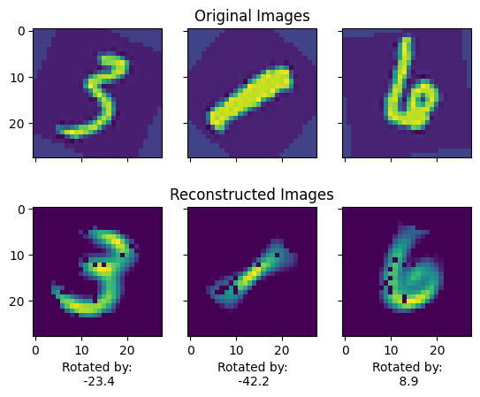
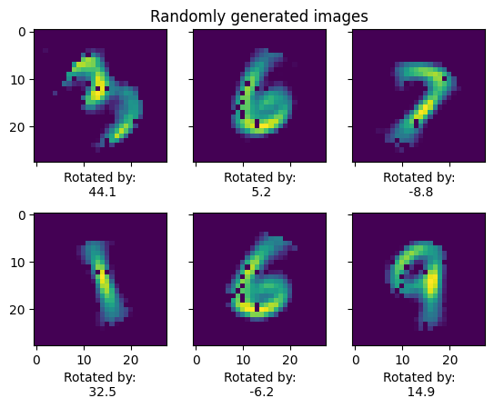

# Implementation of the Conditional Variational Autoencoder (CVAE)

The CVAE is a generative model that allows us to sample from the data distribution after training, conditioned on some covariates.
We implement the model using the MNIST dataset. We augment the dataset by rotating the images by an angle $\in [-45, 45]$ degrees.
Our conditional variables are then:

- The digit (from 0-9),
- The angle of rotation (from -45 to 45 degrees).

### Reconstructing the images after training

### Generating a random sample of images based on our covariates

To add:
- config file
- GPU support
